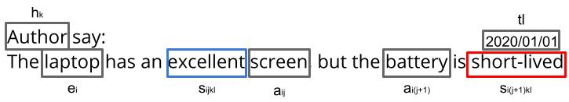

# Multi-Domain Aspect Extraction using Bidirectional Encoder Representations from Transformers

This repository contains supplementary material of the paper "Multi-Domain Aspect Extraction using Bidirectional Encoder Representations from Transformers" submitted to the IEEE Access (under review).

**Abstract**: *Deep learning and neural language models have obtained state-of-the-art results in aspects extraction tasks, in which the objective is to automatically extract characteristics of products and services that are the target of consumer opinion. However, these methods require a large amount of labeled data to achieve such results. Since data labeling is a costly task, there are no labeled data available for all domains. In this paper, we propose an approach for aspect extraction in a multi-domain transfer learning scenario, thereby leveraging labeled data from different source domains to extract aspects of a new unlabeled target domain. Our approach, called MDAE-BERT (Multi-Domain Aspect Extraction using Bidirectional Encoder Representations from Transformers), explores neural language models to deal with two major challenges in multi-domain learning: (1) inconsistency of aspects from target and source domains and (2) context-based semantic distance between ambiguous aspects. We evaluated our MDAE-BERT considering two perspectives (1) the aspect extraction performance using F1-Macro and Accuracy measures; and (2) by comparing the multi-domain aspect extraction models and single-domain models for aspect extraction. In the first perspective, our method outperforms the baseline. In the second perspective, our approach proved to be a competitive alternative compared to the single-domain model trained in a specific domain, even in the absence of labeled data from the target domain.*

<hr>

Opinion Mining is the task of extracting opinions or sentiments from unstructured texts using Natural Language Processing (NLP), Text Mining and Machine Learning. The key idea is to analyze automatically large review datasets to classify them into sentiment polarities (i.e., positive, negative or neutral).

Opinions are formally defined as a 5-tuple (e<sub>i</sub>, a<sub>ij</sub>, s<sub>ijkl</sub>, h<sub>k</sub>, t<sub>l</sub>), where e<sub>i</sub> is the i-th entity of the opinion, a<sub>ij</sub> is the j-th aspect on which the opinion is related, s<sub>ijkl</sub> is the sentiment contained in the opinion that can be positive, negative or neutral, h<sub>k</sub> is the k-th holder of the opinion and t<sub>l</sub> is temporal information about the opinion.



Aspect-based sentiment analysis is the most promising scenario for Opinion Mining, providing a detailed analysis of consumers' opinions about products and services. However, it is a more complex scenario due to the requirement to extract aspects from the reviews before sentiment classification.

In this work we use the IOB representation for token labels. The IOB is short for inside, outside, beginning. Each token of a text in the training set is labeled with <b>class B</b>, which indicates that the token represents the <u>beginning</u> of an aspect; <b>class I</b>, which indicates that the token is <u>inside</u> an aspect; and <b>class O</b>, which indicates that the token is <u>outside</u> an aspect. The IOB representation is illustrated in Figures bellow:


## Using a pre-trained MDAE-BERT model

If you want to use our pre-trained MDAE-BERT to extract aspect from reviews, then start with the MDAE-BERT API demo code. We trained MDAE-BERT with 15 datasets ([available here](https://drive.google.com/uc?id=1UXzERbIVny5BLCqadqTTpDoiBZA97qCv)) from different domains.

* [Pre-trained MDAE-BERT Model (Google Colab)](https://colab.research.google.com/drive/1eZCZzQVGV05w29izmL0etUGtedoK2ijN)

## Training your own MDAE-BERT model

### 1. Requirements
To run is required a dataset file where each line represents an edge in the following format:
```shell
pip install -r requirements.txt
```

#### (Optional) 1.1 Datasets (you can use these datasets or your own)
[download here](https://drive.google.com/uc?id=1UXzERbIVny5BLCqadqTTpDoiBZA97qCv)

### 2 Train a MDAE-BERT model
To train a MDAE-BERT you need to provide the datasets separated by commas, as in the example below.
```shell
python train.py --datasets aspect_datasets/canon/canon.xml.seg,aspect_datasets/diaper_champ/diaper_champ.xml.seg
```